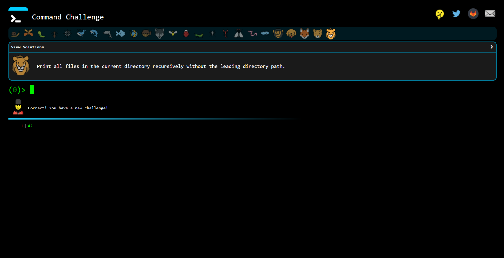

# challenge-prework-03
Recap: Curso de Introducción a la Terminal y Línea de Comandos

## Retos:

1. Screenshot de evidencia de 15+ retos en cmdchallenge.com

> Nota: El resultado que se muestra en el screenshot de abajo pertenece al reto #24. Ya no pude resolver el que seguia. 
(En la carpeta *images* de este repositorio contiene la captura de cada uno de los retos que logre resolver)

## Pasos a seguir:

1. Hacer un "Fork" de este proyecto.
2. Revolver los retos propuestos en cmdchallenge.com.
3. Edita este documento "README.md" con un screenshot mostrando la solucion a tus retos.
4. Crear un Pull Request hacia este repositorio.

## ¿Cómo contribuir?

Si quieres agregar o mejorar algo, te invito a colaborar directamente en este repositorio: [challenge-prework-03](https://github.com/platzimaster/challenge-prework-03/)

## Licencia

challenge-prework-03 se lanza bajo la licencia [MIT](https://opensource.org/licenses/MIT).
